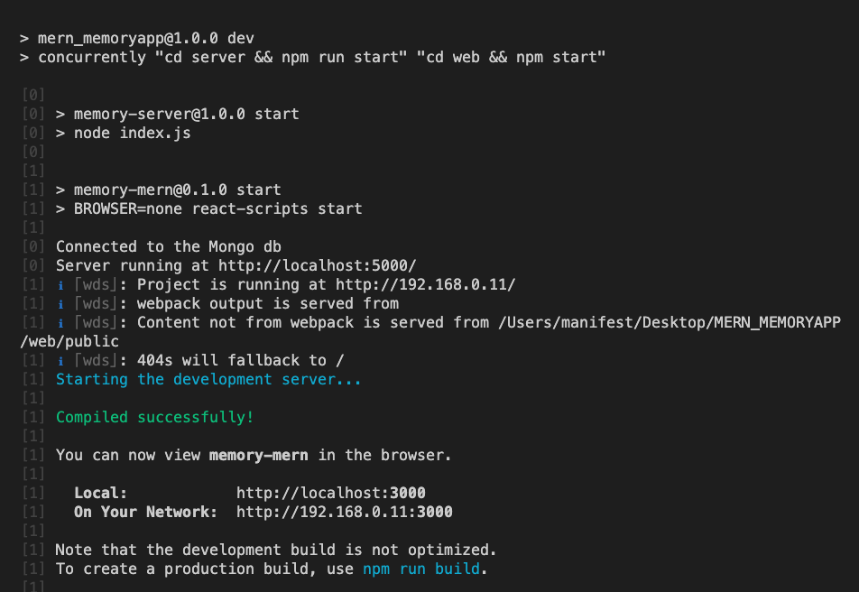
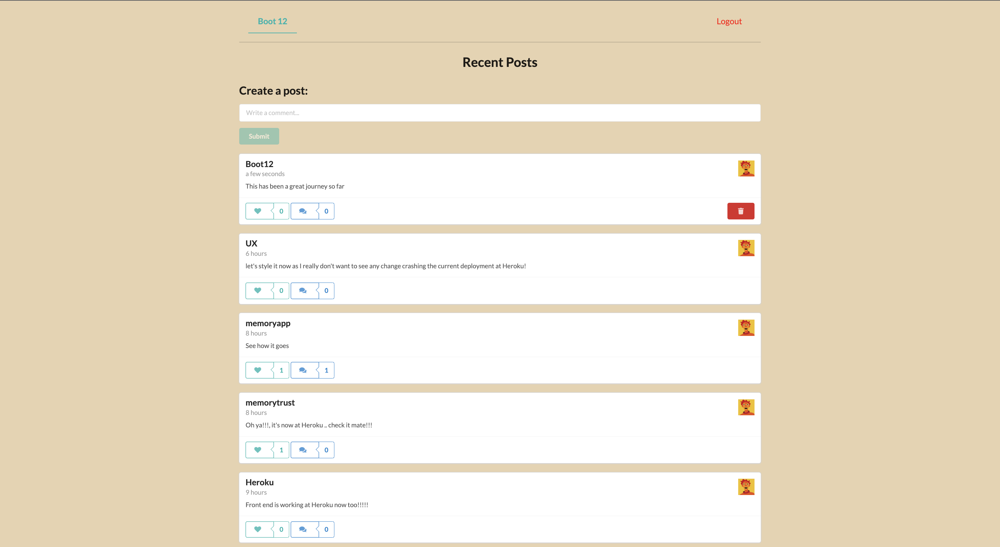
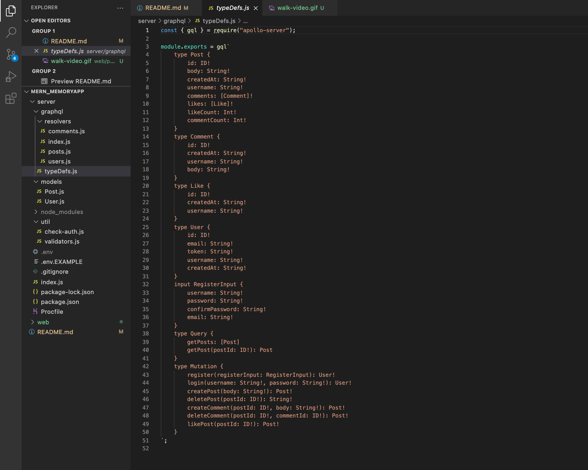
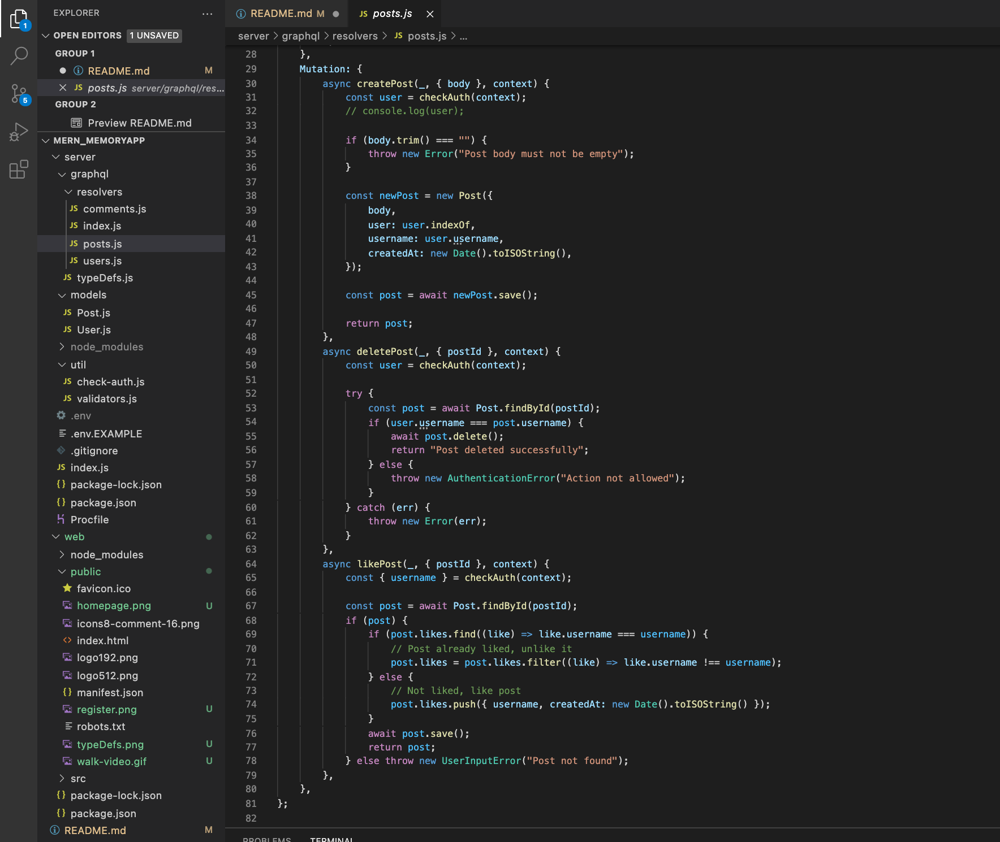
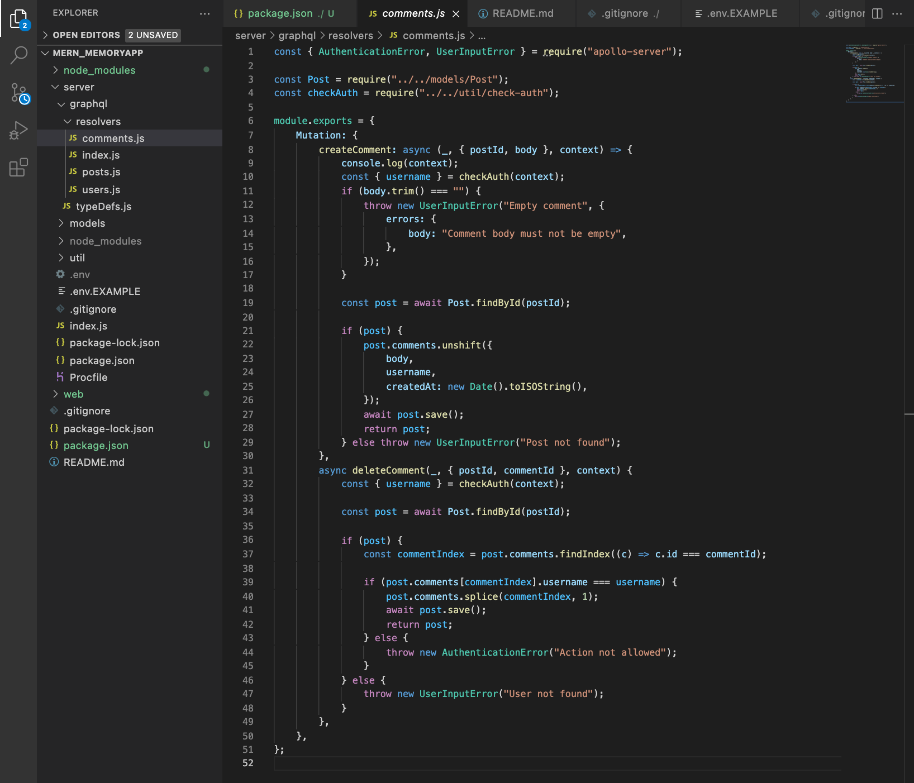
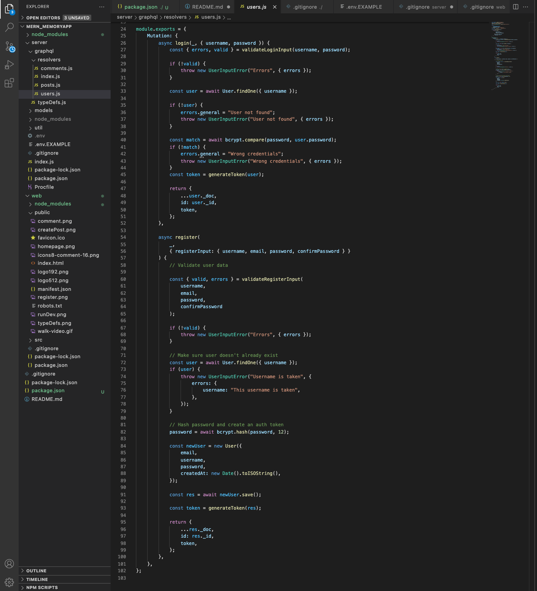
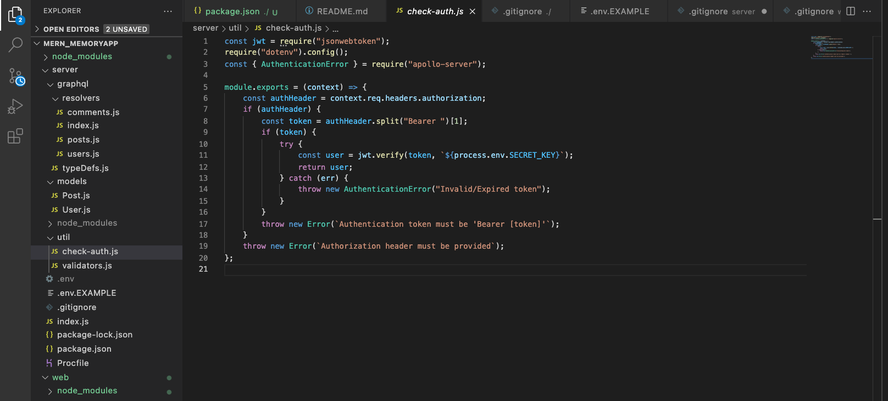
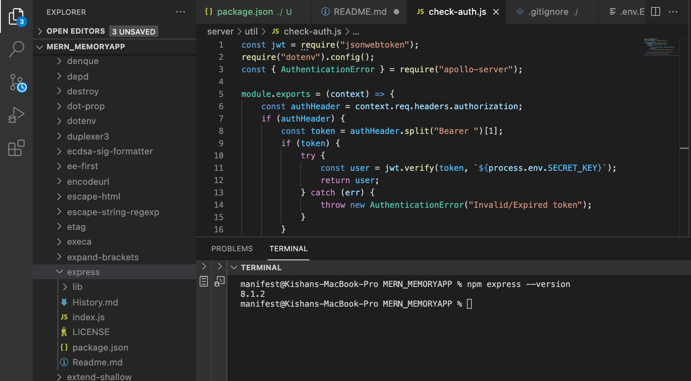

# MERN_MEMORYAPP
This is a Full MERN stack application

## Description

This is a full MERN Stack application using the CRUD principles and has utilised all the MERN technologies which include MONGO DB, EXPRESS, REACT, and NODE

This app is a basic social media app in which you can create a user, and the user can add comments or posts to a global window. This user can also add comments or delete comments on other user's post, and lastly this app can let a user like or dislike content.

We initially wanted to create an app that can be used from patients who have demantia, and their family members and friends can use an app to store all the important information

Hence there is a JWT Token used within this app that hashes passwords so that the information has authentication

This is a `Walk Through` video

## Tabel of Contents

* [Installation](#installation)
* [Usage](#usage)
* [Contribute](#contribute)
* [Tests](#tests)
* [Screenshots](#screenshots)
* [Technology](#technology)
* [Making](#making)
* [Github-Heroku](#Heroku)
* [Questions](#questions)

# Installation

In order to run this application, you will need to do the following:

`INTIAL STEP MONGO` -> Using the .env.EXAMPLE (cd server) you can create your own mongo URI from atlas and create your own secret and add these to the .env file

## Install and Testing

`FIRST` -> 

- npm install

`SECOND` ->

- npm start

** (Image below)

** 

## Usage

In order to use this app, you will need to understand the following;

- MongoDB
- Express.js
- React.js
- Node.js
- Apollo Server
- GraphQL
- Javascript
- JWT (JSONWebToken)

## Contribute

In order to contribute to this app, you will need to understand the following;

- MongoDB
- Express.js
- React.js
- Node.js
- Apollo Server
- GraphQL
- Javascript
- JWT (JSONWebToken)

## Tests

To run tests, please use the following command:

- npm run test

## Screenshots of deployed app

## Technology

- Github
- MongoDB
- Express.js
- React.js
- Node.js
- Apollo Server
- GraphQL
- Javascript
- JWT (JSONWebToken)

## Making

These are the screenshots of the code 

typeDefs.js

createPost

comment.js mutations

users.js mutations 

Apollo and check-auth.js 

Apollo uses integrated express and this is the proof

## Heroku Hosting Github Links

- [Server] (https://github.com/chentriangoes/memorytrust-server)
- [Client] (https://github.com/chentriangoes/memorytrust-web)

## Developers and Questions

Please click the links below to visit our github pages

[KISHAN] (https://github.com/kishan254)

[CHEN] (https://github.com/chentriangoes)

Write us on;

[Kishan's-Email] (kishan.gosrani@hotmail.com)
[Chen's-Email] (chentriangoes@gmail.com)

## License

MIT

